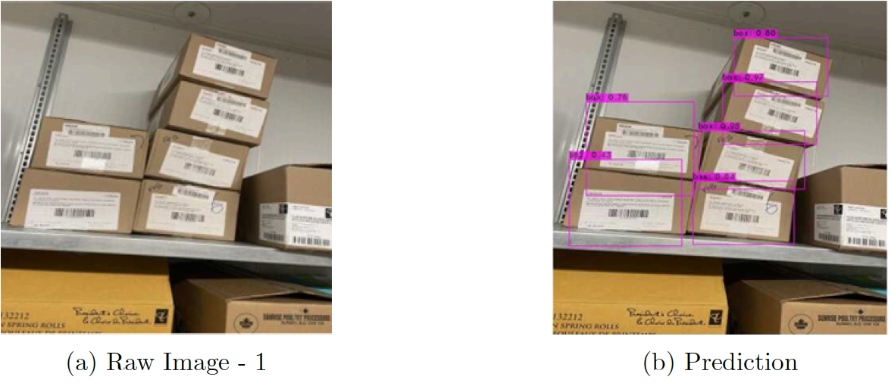
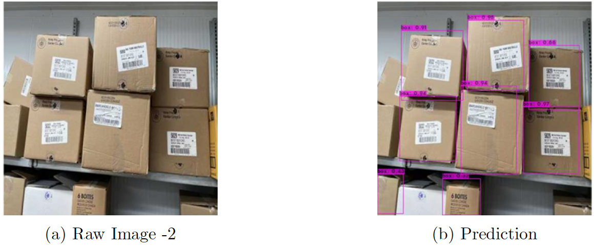
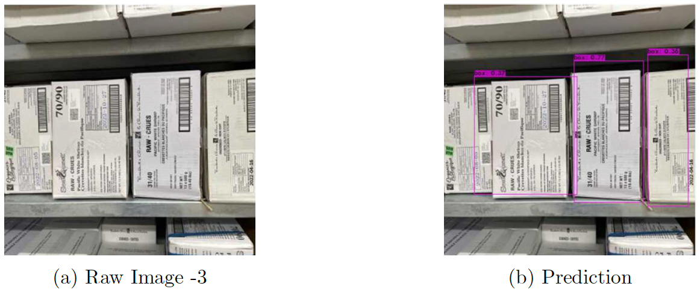
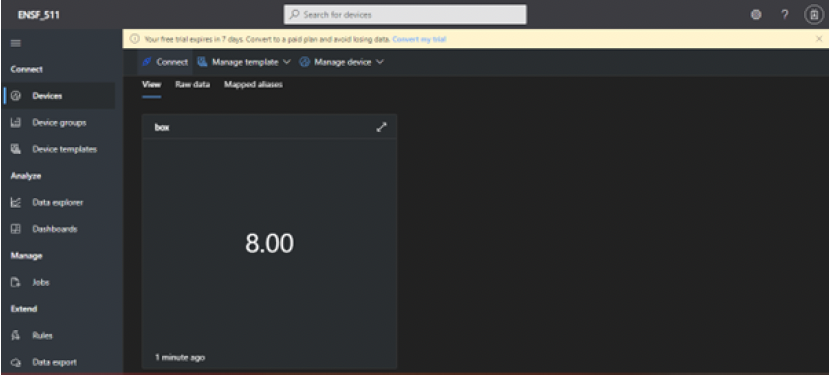

# Smart Warehouse System

Frozen products are available and consumed in almost every corner of the world. There are
several advantages of frozen products like increased shelf life, cheaper than the conventional
food etc. All these products are stored in inventory operating at temperatures beyond -18C and sorting this inventory might be a tough task when humans are involved. Conventional freezers can’t be kept open for long time as it runs on CO2 and counting the boxes for daily inventorying can be considered inhumane. So, we have to find ways to automate the process
of counting the boxes where human reach is usually not considerable.

In this project, a smart warehouse counting system has been implemented using Artificial
intelligence, IoT and cloud where the counting of boxes can be done remotely and slightest human intervention.

## Dataset

This dataset was exported via roboflow.ai.

It includes 340 images.
Box are annotated in YOLO v3 Darknet format.

The following pre-processing was applied to each image:

Auto-orientation of pixel data (with EXIF-orientation stripping)
Resize to 416x416 (Stretch)
The following augmentation was applied to create 3 versions of each source image:

50% probability of horizontal flip
50% probability of vertical flip
Random rotation of between -10 and +10 degrees

Link for dataset: https://www.kaggle.com/datasets/sampreetvaidya/warehouse-box-count

## Prediction results

## Remote Access

As one of the goal of this project was to access our result from the cloud itself, I have used Microsoft Azure IoT central for it. Azure IoT central is an IoT application platform that is used to create the IoT solutions with an ready to use User interface and API which can be used to connect and manage the edge devices. For this project, a free trial was used. In the figure given below, we can see the screen shot of azure Iot central showing the number of boxes.

## References

• Bochkovskiy, Alexey, Chien-Yao Wang, and Hong-Yuan Mark Liao. ”Yolov4: Optimal
speed and accuracy of object detection.” arXiv preprint arXiv:2004.10934 (2020).  
• Voutos, Yorghos Drakopoulos, Georgios & Mylonas, Phivos. (2019). Smart Agriculture:
An Open Field For Smart Contracts.  
• Train YOLOv4-tiny on Custom Data - Lightning Fast Object Detection. Roboflow.
https://blog.roboflow.com/train-yolov4-tiny-on-custom-data-lighting-fast-detection/  
• YOLOv4 vs YOLOv4-tiny, Medium.com.
https://medium.com/analytics-vidhya/yolov4-vs-yolov4-tiny-97932b6ec8ec  
• Google Colaboratory
https://colab.research.google.com
• Machine Learning Tracking using Raspberry Pi.  
https://www.hackster.io/
• Microsoft Azure IoT central  
https://azure.microsoft.com/en-us/services/iot-central/
• Yolo v4, v3 and v2 for Windows and Linux, by AlexyAB.  
https://github.com/AlexeyAB/darknet
• Roboflow.com for splitting,preprocessing and augmentation of dataset.
https://app.roboflow.com  
• Raspbian Pi for home.
https://www.raspberrypi.com/for-home/  
